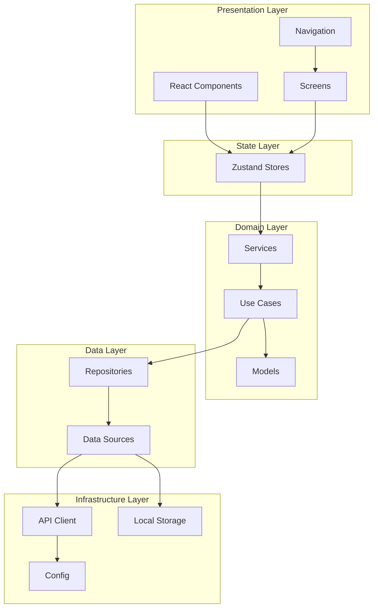
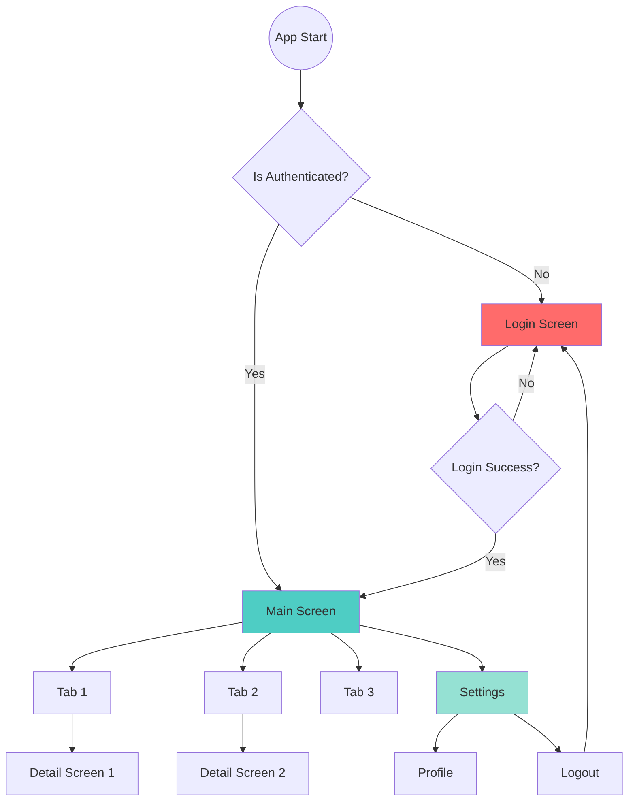
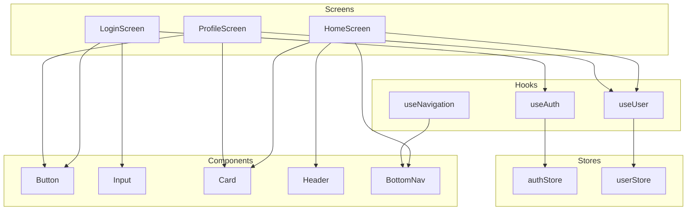
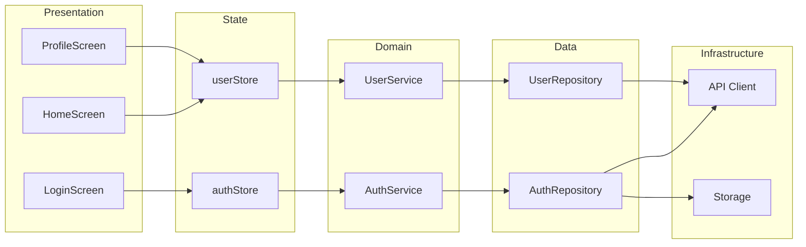
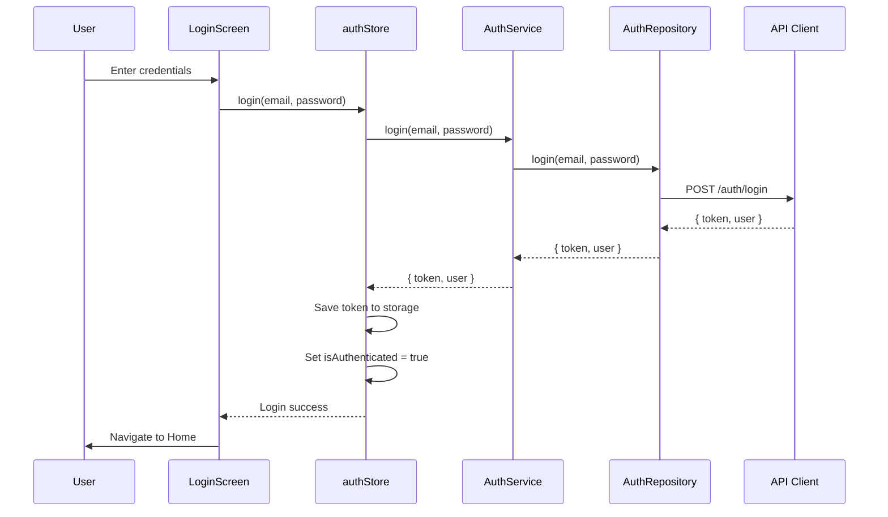
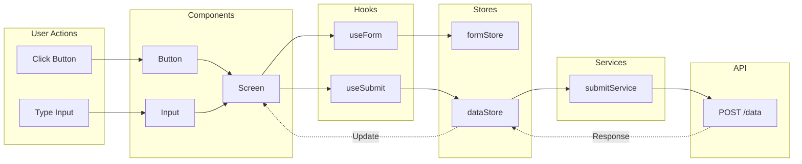
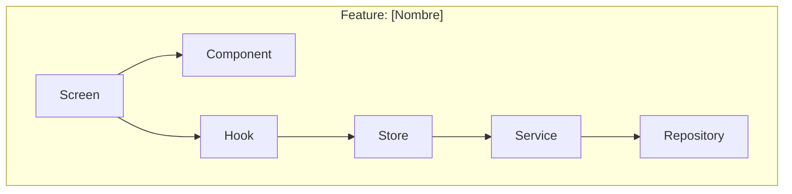
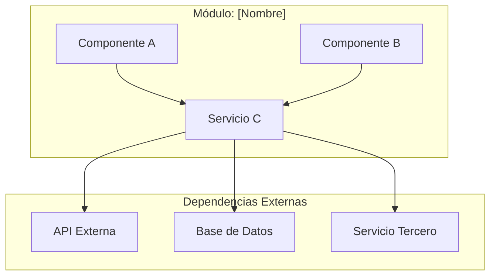

# Mermaid Diagram Templates

## Propósito
Proporcionar plantillas estandarizadas para generar diagramas de arquitectura en formato Mermaid, facilitando la documentación visual de la arquitectura del proyecto, flujos de navegación, relaciones entre componentes y dependencias entre módulos.

## Cuándo usarlo
- Al documentar la arquitectura del proyecto
- Al crear specs que requieren diagramas de arquitectura
- Al generar documentación técnica para módulos
- Al visualizar flujos de navegación
- Al representar dependencias entre capas o componentes
- Al crear diagramas para presentaciones o onboarding
- Para frontend-documentation-agent al generar documentación

## Alcance
- Diagramas de arquitectura en capas (C4 Model)
- Diagramas de flujo de navegación
- Diagramas de arquitectura de componentes
- Grafos de dependencia entre módulos
- Diagramas de secuencia para flujos críticos
- NO genera diagramas automáticamente (solo proporciona plantillas)
- NO valida sintaxis de Mermaid (responsabilidad del usuario)
- NO reemplaza herramientas de diagramación profesional

## Patrón principal

### 1. Diagrama de arquitectura en capas (C4 Model - Container)



### 2. Diagrama de flujo de navegación



### 3. Diagrama de arquitectura de componentes



### 4. Grafo de dependencia entre módulos



### 5. Diagrama de secuencia para flujo crítico



### 6. Diagrama de flujo de datos (Data Flow)



## Plantillas personalizables

### Template básico para feature



### Template para módulo con dependencias externas



## Guía de uso

### Convenciones de estilo

```mermaid
%% Definir estilos personalizados
classDef primary fill:#4ecdc4,stroke:#333,stroke-width:2px
classDef secondary fill:#95e1d3,stroke:#333,stroke-width:2px
classDef critical fill:#ff6b6b,stroke:#333,stroke-width:2px
classDef warning fill:#ffd93d,stroke:#333,stroke-width:2px

%% Aplicar estilos
class Screen,Component primary
class Store,Service secondary
class API,Database critical
```

### Mejores prácticas

1. **Mantener simplicidad**: No más de 15-20 nodos por diagrama
2. **Usar subgrafos**: Agrupar elementos relacionados por capa o módulo
3. **Dirección consistente**: Usar TB (top-bottom) o LR (left-right) consistentemente
4. **Nombres descriptivos**: Usar nombres claros y concisos para nodos
5. **Colores semánticos**: Usar colores para indicar tipo o estado
6. **Leyendas**: Incluir leyenda si hay múltiples tipos de elementos

### Herramientas para renderizar

- **Mermaid Live Editor**: https://mermaid.live
- **GitHub/GitLab**: Renderizado nativo en Markdown
- **VS Code**: Extensión "Markdown Preview Mermaid Support"
- **Notion/Obsidian**: Soporte nativo o mediante plugins
- **Docusaurus**: Plugin oficial de Mermaid

## Integración con agentes

### Para frontend-documentation-agent
- Usa estas plantillas para generar diagramas en documentación
- Adapta plantillas según el módulo o feature documentado
- Incluye diagramas en READMEs de módulos
- Genera diagramas de arquitectura para specs

### Para plan-builder
- Usa diagramas de capas para visualizar arquitectura propuesta
- Genera grafos de dependencia para planificar refactorizaciones
- Crea diagramas de flujo para features complejas
- Incluye diagramas en planes de implementación

### Para frontend-agent
- Usa diagramas de componentes para visualizar relaciones
- Genera diagramas de secuencia para flujos críticos
- Crea grafos de dependencia para validar arquitectura
- Incluye diagramas en specs de features

## Restricciones
- NO genera diagramas automáticamente (solo proporciona plantillas)
- NO valida sintaxis de Mermaid (responsabilidad del usuario)
- NO reemplaza herramientas de diagramación profesional
- NO incluye datos sensibles en diagramas
- Mantener diagramas simples y legibles
- Usar plantillas como punto de partida, personalizar según necesidad
- Validar que diagramas reflejan implementación real
- Actualizar diagramas cuando cambia la arquitectura
