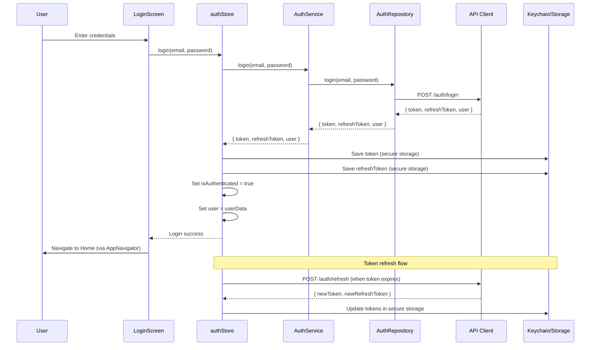
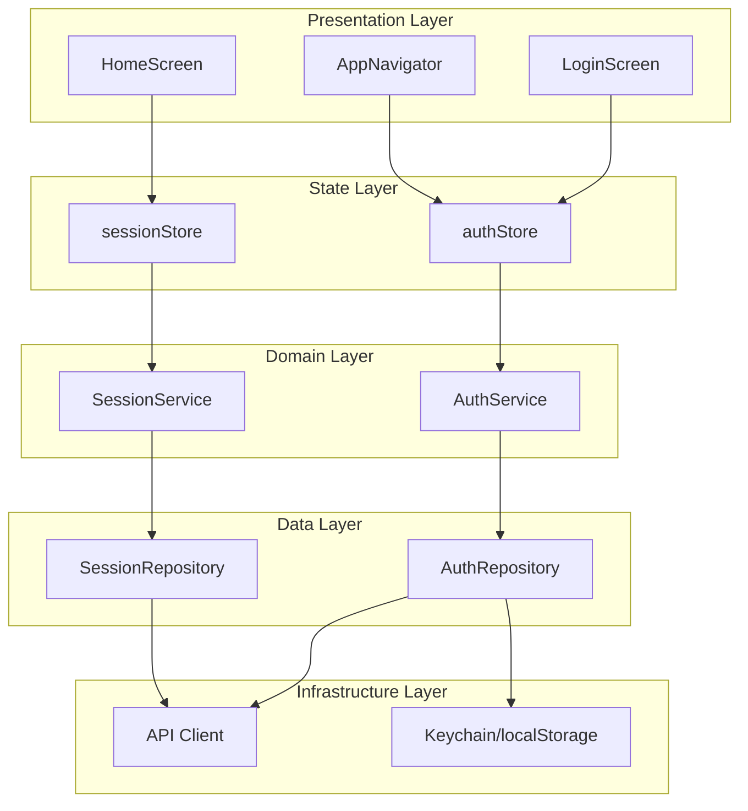

# Guía de Uso de Skills Nuevas

> **Fecha:** 2026-06-15  
> **Propósito:** Demostrar el uso práctico de las 8 skills nuevas creadas en el contexto del proyecto BeanAuditorApp.

---

## Tabla de Contenidos

1. [sdd-audit-protocol](#1-sdd-audit-protocol)
2. [code-generation-templates](#2-code-generation-templates)
3. [debugging-workflow](#3-debugging-workflow)
4. [test-coverage-reporter](#4-test-coverage-reporter)
5. [design-tokens-validator](#5-design-tokens-validator)
6. [platform-compatibility-matrix](#6-platform-compatibility-matrix)
7. [state-migration-helper](#7-state-migration-helper)
8. [mermaid-diagram-templates](#8-mermaid-diagram-templates)

---

## 1. sdd-audit-protocol

### Escenario: Auditoría de un nuevo componente de tarjeta NFC

**Contexto:** `frontend-agent` acaba de descomponer la spec `FEAT-012` en sub-specs. La sub-spec `FEAT-012c` implementa el componente `NfcCard.tsx` en `src/presentation/components/`.

**Flujo de auditoría:**

```
1. frontend-agent termina de implementar FEAT-012c
2. frontend-agent invoca frontend-ui-agent para auditoría post-implementación
3. frontend-ui-agent carga skill sdd-audit-protocol
4. frontend-ui-agent lee el protocolo y ejecuta auditoría:
   - Lee src/presentation/components/NfcCard.tsx
   - Evalúa uso de tokens de tema
   - Evalúa consistencia con otros componentes
   - Genera reporte con formato estándar
5. Si hay hallazgos critical/high → FEAT-012c se marca como blocked
6. Si todo OK → FEAT-012c se marca como completed
```

**Ejemplo de respuesta del auditor (frontend-ui-agent):**

```json
{
  "summary": "Auditoría de diseño visual para NfcCard: componente consistente con el sistema de diseño.",
  "findings": [
    {
      "severity": "low",
      "location": "src/presentation/components/NfcCard.tsx:45",
      "description": "Sombra inconsistente con Card.tsx",
      "impact": "Menor inconsistencia visual",
      "recommendation": "Usar theme.shadows.md en lugar de elevation: 2"
    }
  ],
  "overall": "approve",
  "confidence": "alta",
  "notes": "Solo hallazgo de severidad baja, no bloquea"
}
```

**Cuándo usar:**
- Cada vez que un auditor (ui, ux, accessibility, state, architecture, cross-platform, performance, navigation, testing, security) necesita validar una spec o implementación
- En flujo SDD para auditoría pre y post-implementación

---

## 2. code-generation-templates

### Escenario: Crear un nuevo hook `useNfcScan`

**Contexto:** Necesitas crear un hook para manejar escaneo NFC que siga los patrones del proyecto.

**Uso de la skill:**

```
1. frontend-agent carga skill code-generation-templates
2. Selecciona plantilla "Hook custom"
3. Adapta al contexto del proyecto:
```

**Resultado generado:**

```typescript
// src/presentation/hooks/useNfcScan.ts
import { useState, useCallback } from 'react';
import { useNfcStore } from '../../state/nfcStore';
import { theme } from '../themes/theme';

interface UseNfcScanReturn {
  isScanning: boolean;
  lastScannedTag: string | null;
  error: string | null;
  startScan: () => Promise<void>;
  stopScan: () => void;
  reset: () => void;
}

export const useNfcScan = (): UseNfcScanReturn => {
  const [isScanning, setIsScanning] = useState(false);
  const [lastScannedTag, setLastScannedTag] = useState<string | null>(null);
  const [error, setError] = useState<string | null>(null);
  
  const { addScannedTag } = useNfcStore();

  const startScan = useCallback(async () => {
    try {
      setIsScanning(true);
      setError(null);
      // Lógica de escaneo NFC
      const tag = await scanNfcTag();
      setLastScannedTag(tag);
      addScannedTag(tag);
    } catch (err) {
      setError(err.message);
    } finally {
      setIsScanning(false);
    }
  }, [addScannedTag]);

  const stopScan = useCallback(() => {
    setIsScanning(false);
  }, []);

  const reset = useCallback(() => {
    setLastScannedTag(null);
    setError(null);
  }, []);

  return {
    isScanning,
    lastScannedTag,
    error,
    startScan,
    stopScan,
    reset,
  };
};
```

**Cuándo usar:**
- Al crear componentes, screens, hooks, stores, services o repositories nuevos
- Para asegurar consistencia con patrones del proyecto

---

## 3. debugging-workflow

### Escenario: Error "undefined is not an object" en LoginScreen

**Contexto:** Usuarios reportan crash en LoginScreen al intentar hacer login en iOS.

**Uso de la skill:**

```
1. frontend-agent carga skill debugging-workflow
2. Sigue flujo de diagnóstico estructurado:

Paso 1: Recopilar información
- Síntoma: Crash con "undefined is not an object (evaluating 'user.email')"
- Cuándo: Al presionar botón "Login" en iOS
- Plataforma: iOS (Android funciona)
- Desde cuándo: Después de último merge

Paso 2: Clasificar → Crash

Paso 3: Aislar
- git log → último cambio: "feat: add user validation"
- git diff → se modificó authStore.ts
- El cambio accede a user.email sin validación de null

Paso 4: Diagnosticar
- Causa raíz: user puede ser null después de logout
- No hay optional chaining en LoginScreen.tsx:67

Paso 5: Solución
- Agregar optional chaining: user?.email
- Agregar validación de null antes de acceder a propiedades
- Test para validar fix
```

**Checklist aplicado:**

```markdown
- [x] ¿Puedo reproducir el problema consistentemente? Sí
- [x] ¿Identifiqué el componente/módulo afectado? LoginScreen.tsx
- [x] ¿Revisé cambios recientes (git log)? Sí, último merge
- [x] ¿Verifiqué logs y mensajes de error? Sí, crash report
- [x] ¿Probé en todas las plataformas afectadas? iOS (crash), Android (OK)
- [x] ¿Aislé la causa raíz antes de fix? Sí, user null sin validación
- [x] ¿El fix es mínimo y no introduce regresiones? Sí, optional chaining
- [x] ¿Documenté el problema y solución? Sí, en commit message
```

**Cuándo usar:**
- Al enfrentar errores, crashes o comportamiento inesperado
- Para diagnóstico estructurado de problemas

---

## 4. test-coverage-reporter

### Escenario: Auditoría de cobertura antes de release

**Contexto:** Antes del release v2.3.0, necesitas validar que la cobertura de tests cumple los umbrales mínimos.

**Uso de la skill:**

```bash
# Ejecutar cobertura completa
npm test -- --coverage --watchAll=false

# Cobertura para módulos críticos
npm test -- --coverage --watchAll=false --collectCoverageFrom='src/state/authStore.ts'
```

**Reporte generado:**

```markdown
# Reporte de Cobertura - 2026-06-15

## Resumen ejecutivo
- Cobertura global: 74%
- Módulos analizados: 38
- Tests totales: 187

## Análisis por capa
| Capa | Cobertura | Umbral | Estado |
|------|-----------|--------|--------|
| state/ | 82% | 75% | ✅ OK |
| domain/ | 78% | 80% | ⚠️ Mejorar |
| data/ | 71% | 70% | ✅ OK |
| presentation/ | 52% | 50% | ✅ OK |
| infrastructure/ | 68% | 60% | ✅ OK |

## Módulos críticos (< umbral)
1. src/domain/services/AuditService.ts: 72% (objetivo: 80%)
   - Funciones sin tests: validateAudit(), exportAudit()
   
2. src/state/nfcStore.ts: 68% (objetivo: 75%)
   - Ramas no cubiertas: error handling en scanTag()

## Recomendaciones
1. Agregar tests para AuditService.validateAudit() y exportAudit()
2. Cubrir error handling en nfcStore.scanTag()
3. Priorizar domain/ para alcanzar 80% antes de release
```

**Cuándo usar:**
- Antes de merges o releases
- Para identificar gaps en cobertura
- Para auditorías de calidad de testing

---

## 5. design-tokens-validator

### Escenario: Auditoría de consistencia visual en componentes

**Contexto:** Revisar que los nuevos componentes de la feature NFC usan correctamente los tokens del theme.

**Uso de la skill:**

```bash
# Buscar colores hardcodeados en componentes NFC
grep -r "#[0-9A-Fa-f]\{6\}" src/presentation/components/Nfc*.tsx

# Buscar spacing hardcodeado
grep -r "padding:\s*[0-9]" src/presentation/components/Nfc*.tsx
```

**Reporte generado:**

```markdown
# Reporte de Validación de Design Tokens

## Componentes analizados: 5
- NfcCard.tsx
- NfcScanButton.tsx
- NfcStatusIndicator.tsx
- NfcTagList.tsx
- NfcErrorBanner.tsx

## Issues encontrados

### Críticos (colores hardcodeados)
1. `src/presentation/components/NfcCard.tsx:23`
   - Issue: Color hardcodeado `#3B82F6`
   - Recomendación: Usar `theme.colors.primary`

2. `src/presentation/components/NfcStatusIndicator.tsx:15`
   - Issue: Color hardcodeado `rgb(34, 197, 94)`
   - Recomendación: Usar `theme.colors.success`

### Medios (spacing hardcodeado)
3. `src/presentation/components/NfcTagList.tsx:34`
   - Issue: Padding hardcodeado `16`
   - Recomendación: Usar `theme.spacing.md`

## Cumplimiento por componente
| Componente | Colores | Spacing | Typography | Estado |
|------------|---------|---------|------------|--------|
| NfcCard | ❌ 1 | ✅ 0 | ✅ 0 | ⚠️ |
| NfcScanButton | ✅ 0 | ✅ 0 | ✅ 0 | ✅ |
| NfcStatusIndicator | ❌ 1 | ✅ 0 | ✅ 0 | ⚠️ |
| NfcTagList | ✅ 0 | ❌ 1 | ✅ 0 | ⚠️ |
| NfcErrorBanner | ✅ 0 | ✅ 0 | ✅ 0 | ✅ |

## Recomendaciones
1. Reemplazar 2 colores hardcodeados con tokens del theme
2. Migrar 1 spacing hardcodeado a token de spacing
3. Considerar agregar lint rule para prevenir hardcodes futuros
```

**Cuándo usar:**
- Al auditar componentes de UI
- Para validar cumplimiento del sistema de diseño
- Antes de cerrar tareas de UI

---

## 6. platform-compatibility-matrix

### Escenario: Implementar almacenamiento seguro para tokens NFC

**Contexto:** Necesitas almacenar tokens NFC de forma segura. En native usarás Keychain, pero en web necesitas una alternativa.

**Uso de la skill:**

```
1. frontend-agent consulta platform-compatibility-matrix
2. Busca API: react-native-keychain
3. Matriz indica: ❌ No soportado en web, shim necesario
4. Decide estrategia:
   - Native: usar Keychain
   - Web: crear shim con localStorage (con advertencia de seguridad)
   - Crear archivo .native.ts y .web.ts
```

**Implementación:**

```typescript
// src/infrastructure/adapters/secureStorage.native.ts
import Keychain from 'react-native-keychain';

export const secureStorage = {
  setItem: async (key: string, value: string) => {
    await Keychain.setGenericPassword(key, value, {
      service: 'com.beanauditor.secure',
    });
  },
  getItem: async (key: string) => {
    try {
      const credentials = await Keychain.getGenericPassword({
        service: 'com.beanauditor.secure',
      });
      return credentials ? credentials.password : null;
    } catch {
      return null;
    }
  },
};
```

```typescript
// src/infrastructure/adapters/secureStorage.web.ts
// ⚠️ ADVERTENCIA: localStorage no es seguro para datos sensibles
// En web, considerar encryptar antes de almacenar
export const secureStorage = {
  setItem: async (key: string, value: string) => {
    // TODO: Implementar encryptación antes de almacenar
    localStorage.setItem(`secure_${key}`, value);
  },
  getItem: async (key: string) => {
    return localStorage.getItem(`secure_${key}`);
  },
};
```

**Cuándo usar:**
- Al crear componentes que deben funcionar en native y web
- Al decidir si una API nativa necesita shim web
- Para resolver problemas de diferencias entre plataformas

---

## 7. state-migration-helper

### Escenario: Migrar `sessionStore` de `src/stores/` a `src/state/`

**Contexto:** `sessionStore.ts` aún está en la ubicación legacy `src/stores/`. Necesitas migrarlo a `src/state/` siguiendo el patrón del proyecto.

**Uso de la skill:**

```
1. frontend-agent carga skill state-migration-helper
2. Sigue flujo paso a paso:

Paso 1: Identificar store
- src/stores/sessionStore.ts existe
- Usa patrón Zustand (create())
- Tiene tests en __tests__/stores/sessionStore.test.ts

Paso 2: Copiar a src/state/
- cp src/stores/sessionStore.ts src/state/session.store.ts
- Renombrar siguiendo convención: sessionStore → session.store

Paso 3: Actualizar imports internos
- No requiere cambios (imports relativos se mantienen)

Paso 4: Actualizar imports en código base
- grep -r "stores/sessionStore" src/ → 8 archivos
- Actualizar cada import:
  - src/presentation/screens/SessionScreen.tsx
  - src/presentation/components/SessionCard.tsx
  - src/domain/services/SessionService.ts
  - ... (5 más)

Paso 5: Migrar tests
- cp __tests__/stores/sessionStore.test.ts __tests__/state/session.store.test.ts
- Actualizar imports en test

Paso 6: Validar
- grep -r "stores/sessionStore" src/ __tests__/ → 0 resultados ✅
- npm test → todos pasan ✅

Paso 7: Eliminar legacy
- rm src/stores/sessionStore.ts
- rm __tests__/stores/sessionStore.test.ts
```

**Checklist de migración:**

```markdown
# Checklist de Migración: sessionStore

## Archivos
- [x] Store copiado a src/state/session.store.ts
- [x] Tests copiados a __tests__/state/session.store.test.ts
- [x] Archivo legacy eliminado de src/stores/
- [x] Test legacy eliminado de __tests__/stores/

## Imports
- [x] 8 imports en src/ actualizados
- [x] 1 import en __tests__/ actualizado
- [x] No hay referencias a src/stores/sessionStore
- [x] No hay referencias a __tests__/stores/sessionStore

## Funcionalidad
- [x] Tests del store pasan correctamente (12/12)
- [x] Tests de componentes que usan el store pasan
- [x] Cobertura de tests: 85% (objetivo: 75%) ✅

## Estado global
- [x] Persistencia configurada correctamente
- [x] Selectores eficientes (uso de useShallow)
- [x] No hay rerenders innecesarios
```

**Cuándo usar:**
- Al migrar stores desde `src/stores/` hacia `src/state/`
- Para validar que la migración se completó correctamente

---

## 8. mermaid-diagram-templates

### Escenario: Documentar arquitectura de autenticación

**Contexto:** Necesitas documentar el flujo de autenticación para la spec `FEAT-001`.

**Uso de la skill:**

```
1. frontend-documentation-agent carga skill mermaid-diagram-templates
2. Selecciona plantilla "Diagrama de secuencia para flujo crítico"
3. Adapta al flujo de autenticación del proyecto
```

**Diagrama generado:**



**Diagrama de arquitectura de capas:**



**Cuándo usar:**
- Al documentar arquitectura del proyecto
- Al crear specs que requieren diagramas
- Para generar documentación técnica

---

## Conclusión

Estas 8 skills nuevas proporcionan herramientas especializadas para mejorar la productividad y consistencia del desarrollo en BeanAuditorApp. Cada skill está diseñada para resolver problemas específicos y se integra con los agentes existentes.

**Próximos pasos:**
1. Probar cada skill en escenarios reales
2. Recopilar feedback del equipo
3. Iterar y mejorar basándose en uso real
4. Crear skills adicionales si surgen nuevas necesidades

---

**Documentación mantenida por:** `frontend-documentation-agent`  
**Última actualización:** 2026-06-15
